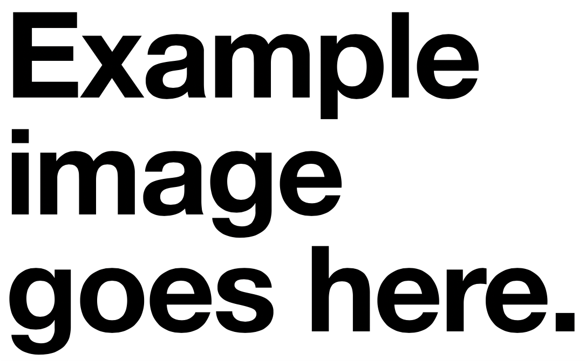

# Game Prototype Report

# WebGL Build

Provide detail of your WebGL build on itch.io:

**URL**:
  > _Write here_

**Password (if required):**
  > _Write here_

# Design Document (50%)
***Instructions***
The following Design Document sections should be completed, regardless of whether you have implemented the feature in your prototype or not. If you have not implemented the feature, your response should reflect any design decisions you would make you were to implement it in a future update to your game. Unimplemented design features should clearly be labelled as **(Unimplemented)**.

Please include screenshots and/or design diagrams/mock-ups to illustrate your point/clarify the discussion. Instructions for how to insert images into the Report.md are provided here: [How to Insert Images in Markdown](#how-to-insert-images-in-markdown)

---

## Player Experience (15%)
### High Concept (5%)
Create a high concept for your game. A high concept should be include:
- What kind of game is it?
- What is unique?
- What is the player doing and feeling?

**Your High Concept (2-4 sentences)**
Dreamride is an endless runner, it takes heavy inspiration from games in the genre but Dreamride stands out, as it is an endless runner with an end. Dreamride tries to mix minor storytelling elements into a space where narritive is rarely present, alonside the use of a vehicle as not just a mechanic/toy, but as a metaphor to explore the final moments of a persons life. In Dreamride, as the players evade, i want the player to be stressing and fearing the non-stop as the cars continuously come forth. Alongisde this stress i want the player to try understand the feeling of sorrow and emathy, and the vulnrability of a persons final moments. 

---

### Experience Goals (8%)
The prototype specifications specified that your game should focus on the primary player experiences of **Challenge** and **Drama** and the secondary player experiences of **Fantasy** and **Sensation**.
Explain how you refined each of these goals to establish a specific design vision for your game? 

Write 1-2 sentences for each. 

- **Challenge:**  
  I refined challenge by designing fast paced gamplay that forcers players to constantly react to the oncoming obstacles, creating an unforgiving experience that reflects the characters mental state. I
  originally was going to use 1 life, but that ended up being to difficult.

- **Drama:**  
To show drama, I build the game around the emotions of a persons final moments, using visual storytelling and progression to show highlight their unfortunante decent. This drama is also enhanced by the
fast flowing nature of the game as it intensifies the emotions.

- **Fantasy:**  
  I explored fantasy by taking the act of driving and turing it into a symbolic journey through decaying environments, allowing players to experience the proccess of a human mind being unravelled and
  that said person acting upon this. Im forcing the player to feel this.

- **Sensation:**  
  Sensation was acheived through the collapsing visuals/environments, the looping eerie music, and the camera that follows the car. These 3 accentuate all of the other experiences and make the
  player feel present in my game.
  

---

### Satisfaction of Player Needs (2%)
- **Which of the SDT needs (autonomy, competency, and/or relatedness) is your game targeting and how? (1 - 2 sentences)**
Dreamride tartgets competency, as players have to hone their reflexes and decision making to survive until the end, with it needing a sense of mastery. It also slightly targets relatedness
as I am inviting the player to emotionally connect with the characters final moments, trying to create empathy.

---

## Game Mechanics (20%)
**Instructions**
In this section, we are looking at the mechanics of your game prototype.
- Write brief 1-2 sentence responses to each question, except where a longer answer is specifically request.
-	Each question should be responded to. If you did not implement a mechanic in your game prototype, then you can base your response on how you might implement that mechanic in future design plans. Use the **(Unimplemented)** tag to indicate where this is the case.

---

### Player Controls and Movement (6%)
- **Describe the movement scheme for the player avatar (e.g., 8-directional, physics-based)?**
My avatar only uses simple 2-directional movement, moving left and right. The continuous downward motion is controlled by gravity.

- **How do obstacles affect player movement and require skill to navigate?**
  Obstacles appear at varying locations with different speeds, requiring good timing and quick reactions to move left or right in time to
  survive.

- **How does this movement scheme align with the avatar identity and contribute to the fantasy of the game?**
My 2-directional is limited compared to other games, but the limited control reflects the characters emotional state, spiraling and set on a
destined path. This reinforces the fantasy, as the player feels hopeless (as they can only move right or left) which parallels the character.

- **How does this movement scheme map to keyboard / gamepad controls?**
  Dreamride doesnt have any gampad controls, on the keyboard the player uses either 'a' or the left arrow to go left, and 'd' or the right arrow to
  move right.

- **How does the control scheme allow for skilful control and contribute to the challenge of the game?**
  This control scheme doesnt really maximise the potential for skilfull control, as it is too simple for it to be complex and isnt considered skillfull.
  The only thing could be the precise timing of dogding the obstacles. However this simplicity makes the game acsessible.

- **What expectation do you have for player familiarity with the movement and control schemes (e.g. experience with particular game genre conventions)?**
Players that have played an endless runner or are familiar with arcade style games will recognise the left/right movment mechanic, making it easy to pick up
while still somewhat difficult to fully master.

---

### Camera Design (2%)
- **How does the camera move in the game?**
  Unfortunatly my camera works very simply, i have the main camera as a child inside of the 'car' (avatar)

- **How does the camera view support the player's ability to navigate the game world and interact with other game objects?**
The camera is fixed to the car, to maintain a constant top down view as the avator moves, I did this to ensure the player can
see the upcoming obsticles, environments and make quick movements. 

---

### Good and Bad Things (5%)
- **How are 'good things' generated in the game?**
  My 'Good thing' is an acceleration boost and are manually placed in the scene using prefabs. 

- **How are 'bad things' generated in the game?**
  My 'Bad thing' is the oncoming cars that reduce the player's health, are also placed using prefabs throughout the game world.

- **How does the generation of good things and/or bad things contribute to the dramatic arc of the game?**
 The placement of the boost offers a chance to increase the adrenaline of the player within the tense envirionment, It gives the
player more challenge, leading the player to enter the flow and add to its dramatic arc.

- **How do bad things create tension & relief?**
  The threat of the unstoppable oncoming cars creates constant tension ad the only way to survive them is to dodge, and succesfully dodging them creates a short moment of releif until you see the next car. 

- **How do moving good things/bad things create challenging navigation?**
 Both the good and bad things make the players quickly asses the risk and then react to it. Boosts are placed in a convenient location to not force the player to take them, but to give the experienced players
an option to increase the difficulty, all this would be happening while the cars continuosly push forward.

---

### Goals (3%)

- **How does the process of losing health create tension & contribute to the dramatic arc?**
Losing health adds constant pressure, making each mistake feel meaningful a. It reinforces the theme of a deteriorating mental state and brings the player closer to the inevitable “end,” enhancing the dramatic arc.
I purposefully didnt decide to add a health bar, as I felt it would take the groundedness out of the game, not having a healthbar shows that we never know when its over.

- **If you turned the scoring system off, what kinds of game play just feel intrinsically fun?**
 My 'scoring system' is the speed increasing, so dodging through tight gaps, avoiding oncoming cars, and making moves to grab boosts could still provide satisfying moments that feel rewarding on their own
but probably only to newer gamers as it could be to easy without the system for experienced players.

- **How does your scoring system encourage the player towards the intrinsic fun of the game?**
  The speed increase from boosts pushes players to take more risks, amplifying both the thrill of movement and the challenge of dodging obstacles. This rewards risky play and reinforces the intense,
  core loop that makes the game fun.

---

### UI, Art & Audio Design (4%)
- **For each UI element, how does the visual design help convey what is important to the player?**
    - **Score**
   The speed of the car visually increases, This acts as a  indicator of progress and intensity, pushing the player to keep moving forward and to keep their momentum.
    - **Health**
    There is no traditional health UI, which reinforces the feeling of vulnerability. Instead, the health remains unknown, reflecting the mystery of the character. 

- **How does the art design support the fantasy of the game? (2 marks; 2  3 sentences)**
The art begins with a grounded setting, a realistic road, but slowly deteriorates as the player progresses. As reality breaks down, the road fragments and disappears, replaced by abstract visuals and depressive words, reinforcing the descent into the character’s fractured mind and emotional collapse. The bright colours of the map also contrast extremely well will the theme, acting as a parallel, the brightness is getting replaced with the darkness.

- **How does the art & audio create an enjoyable sensation for the player? (2 marks; 2  3 sentences)**
The shift from structured environments to chaos keeps the experience dynamic and visually engaging. The soundtrack blends soft piano with ambient dread and sorrow, creating a haunting atmosphere that complements the tension and provides emotional depth.


- **How does art and/or audio support games other design goals (e.g. the dramatic arc)? (3 marks; 1 paragraph)**
 The gradual breakdown of the environment, from the structured road to chaotic visuals and floating depressive words, mirrors the game’s dramatic arc of a mind unraveling.
Audio plays a key role by playing music with eerieness, building tension and sadness over time. This fusion of visual and audio decent emphasises the emotional journey of the
protagonist, aligning with the Challenge, Drama, Fantasy and Sensation.

---

## Playtesting (15%)
**Instructions**
Discuss the results of your platesting. Write a paragraph addressing each of the following questions

- **Did you meet each of your experience goals? Why/why not?**
    - **Challege**
Feedback on challenge was mixed. An experienced player found the difficulty satisfying and balanced, praising the gameplay. However, a new gamer found the game overwhelming and too difficult, suggesting that the learning curve may need adjustment for broader accessibility
    - **Drama**
Players picked up on the tone and understood that the game was dealing with heavy themes, but they felt the narrative could be made more present or direct. While the visuals and music helped hint at the story, they suggested it to be clearer to enhance the drama.
    - **Fantasy**
The fantasy of the journey (driving through a symbolic, mental breakdown) was understood. Players recognized the transition of environments as metaphorical, and this helped them engage with the narrative more.
    - **Sensation**
Sensation was the weakest experience goal during testing. Players mentioned that the visuals (the sprites) and gameplay feedback lacked impact, and the only element that consistently supported the vibe was the music. They suggested that more refined sprites and audio for pickups/crashes could heighten immersion.

- **Did you notice any patterns of play that supported your experience goals? What were they?**
The experienced player tended to take more risks and took the challenge of chasing boosts for increased difficulty, which strongly supported the challenge goal. The players also became more cautious as the environment shifted and the visuals deteriorated, which aligned well with the drama and fantasy goals, showing they were emotionally responding to the change in tone.

- **Did you notice any patterns of play that undermined your experience goals? What were they?**
The new player avoided the acceleration boosts entirely, because they were too focused on avoiding obstacles. This undermined the sensation and challenge goals by reducing Dreamrides intensity and pacing. Additionally, the new player also became frustrated early due to the difficulty, which weakened the challenge experience. A player also didint look at the environment without absorbing the cues or atmosphere, which lessened the impact of the drama and fantasy elements.

- **Considering the results from playtesting, how might you improve the game? (1-2 paragraphs)**
Based on the results, a major improvement would be balancing the game’s difficulty to better accommodate newer players. The current pacing and obstacle layout was designed by me so it favors the experienced player, so introducing a better difficulty curve early on, maybe a slower starting speed or less obstacles, would make the game more accessible without sacrificing challenge for the experienced player. Additionally, the acceleration boosts need reworking to suit both experienced and newer players, maybe by offering temperarily.

Improving the sprite quality and overall visuals would help enhance immersion and sensation. The narrative could be made more present and impactful by having a TextMeshPro text on screen instead of having it on the tilemap, voice lines, and more symbolic visuals in th environment. Reactive sound effects would also strengthen the sensation and drama. Ultimately, improving the movement and behavior of enemy cars will feel more dynamic and intentional, deepening both the gameplay and emotional experience.

---

# Implementation Document
**Instructions:** 
This **Implementation Document** is where you indicate what you have implemented in your game prototype and where the markers will be able can find it within your Unity Project.

Each feature and the marks for implementing them in your prototype has been listed below. For each feature, you must:
1)	Indicate whether you implemented it in your game prototype or not.
2)	Indicate where the marker can find this feature within the Unity Project (identifying particular game objects and visual scripts).
3)	Provide a screenshot(s) of the implemented feature with a caption.

**NOTE:** The marks indicated below reflect the marks for implementing each feature, not for completing the feature entry. This section of the Report is not worth marks directly, but it will aid in marking your prototype, so your grade could be negatively impacted if you have not completed this section and/or it is not clearly presented.

| Feature | Completed | Related GameObject/Script |
|---------|-----------| --------------------------|
| Sprites |  |   |
| Tilemaps |  |  |
| Movement using Transform |  |   |
| Movement using Rigidbody |  |   |
| Keyboard Controls using an Input Asset |  |   |
| Gamepad Controls using an Input Asset |  |   |
| Trigger Colliders |  |   |
| Physics colliders |  |   |
| Collision events |  |   |
| Prefabs |  |   |
| Prefab - Dynamic Instantiation |  |   |
| Object deactivation or destruction |  |   |
| UI layout |  |   |
| UI updating |  |   |
| Camera - Basic |  |   |
| Camera - Cinemachine |  |   |
| Audio - Looping |  |   |
| Audio - Events |  |   |
| WebGL Build | | NA | 
| **Total Implementation Mark** | 50% |


---

## Sprites
Was this feature implemented?
 Yes

If yes, where did you use this feature in your prototype?
- Game Object(s):
"Car", "Accel", "Car Up", "STOP", "Image" (UI in canvas)
- Script(s):
  N/A (Doesnt need scripts)
- Screenshot(s) of feature in game or scene view:
  


---

## Tilemaps
Was this feature implemented?
Yes

If yes, where did you use this feature in your prototype?
- Game Object(s):
  "DreamRideMap"
- Script(s):
  N/A
- Screenshot(s) of feature in game or scene view:
  > _Insert screenshot here_

---

## Movement using Transform
Was this feature implemented?
No

---

## Movement using Rigidbody
Was this feature implemented?
Yes

If yes, where did you use this feature in your prototype?
- Game Object(s):
"Car"
- Script(s):
  "Car movement"
- Screenshot(s) of feature in game or scene view:
  > _Insert screenshot here_

---

## Gamepad Controls using an Input Asset
Was this feature implemented?
  Yes

If yes, where did you use this feature in your prototype?
"Car"
 
- Script(s):
PlayerInputs
- Screenshot(s) of feature:
  > _Insert screenshot here_

---

## Trigger Colliders
Was this feature implemented?
Yes

If yes, where did you use this feature in your prototype?
- Game Object(s):
  "Car", "Car Up","Accel", "STOP"
- Script(s):
  used in CarMovement
- Screenshot(s) of feature in game or scene view:
  > _Insert screenshot here_

---

## Physics colliders
Was this feature implemented?
  Yes

If yes, where did you use this feature in your prototype?
- Game Object(s):
  "Car", "Car Up","Accel", "STOP" 
- Script(s):
  n/a
- Screenshot(s) of feature in game or scene view:
  > _Insert screenshot here_

---

## Collision events

Was this feature implemented?
Yes

If yes, where did you use this feature in your prototype?
- Game Object(s):
 DreamRideMap
- Script(s):
  n/a
- Screenshot(s) of feature in game or scene view:
  > _Insert screenshot here_

---

## Prefabs
Was this feature implemented?
Yes

If yes, where did you use this feature in your prototype?
- Game Object(s):
  "Car", "Accel", "Car up", "Managers", "Canvas" (Car down - unimplemented)
- Script(s):
 n/a
- Screenshot(s) of feature:
  > _Insert screenshot here_

---

## Prefab - Dynamic Instantiation
Was this feature implemented?
No
---

## Object deactivation or destruction
Was this feature implemented?
 Yes

If yes, where did you use this feature in your prototype?
- Game Object(s):
 "Car"
- Script(s):
 CarMovement
- Screenshot(s) of feature in game or scene view:


---

## UI layout
Was this feature implemented?
 Yes

If yes, where did you use this feature in your prototype?
- Game Object(s):
Canvas
- Script(s):
  n/as
- Screenshot(s) of feature in game view:
  > _Insert screenshot here_

---

## UI updating
Was this feature implemented?
  Yes

If yes, where did you use this feature in your prototype?
- Game Object(s):
Managers
- Script(s):
ScoreManager
- Screenshot(s) of feature:
  > _Insert screenshot here_

## Camera - Basic
Was this feature implemented?
 Yes

If yes, where did you use this feature in your prototype?
- Game Object(s):
"car"
- Script(s):
  n/a
- Screenshot(s) of feature in scene view:
  > _Insert screenshot here_

---

### Camera - Cinemachine
Was this feature implemented?
No, was thinking about it, but decided to use the child method


---

### Audio - Looping
Was this feature implemented?
  Yes

If yes, where did you use this feature in your prototype?
- Game Object(s):
"Car"
- Script(s):
 n/a
- Screenshot(s) of feature in scene view:
  > _Insert screenshot here_

---

### Audio - Events
Was this feature implemented?
 No, was going to for crashes and boost pickups


---

### WebGL Build
Was this feature implemented?
  > _Yes / No_

If yes, make sure you include a link to the build at the top of this document.

- Screenshot(s) of game build running in external web browser:
  > _Insert screenshot here_

---

# Third Party Assets

Cite any third part assets you used in your project here, including:
* The name of the asset
* The type of asset (tilemap, sprite, audio file)
* The developer
* A URL for the associate website
* The license under which it is distributed.

Collections of assets can be cited as a single line if they are distributed as a package.

An example has been provided. Delete this line if you didn't use this asset.

| Asset Name | Type | Developer | URL | License |
| ---------- | ---- | --------- | --- | ------- |
| Super Tiled2Unity | Unity Package | Seanba | https://seanba.itch.io/supertiled2unity | Open Source |
| Tiny Town  | Tilemap & Sprites | Kenney | https://kenney.nl/assets/tiny-town | Creative Commons CC0 |

--- 
# How to Insert Images in Markdown
**Instructions:**  
This document should include images. To insert an image into your documentation, place it in the "Images" subfolder, then place the below text where you want the image to appear:

```

```

Example:


